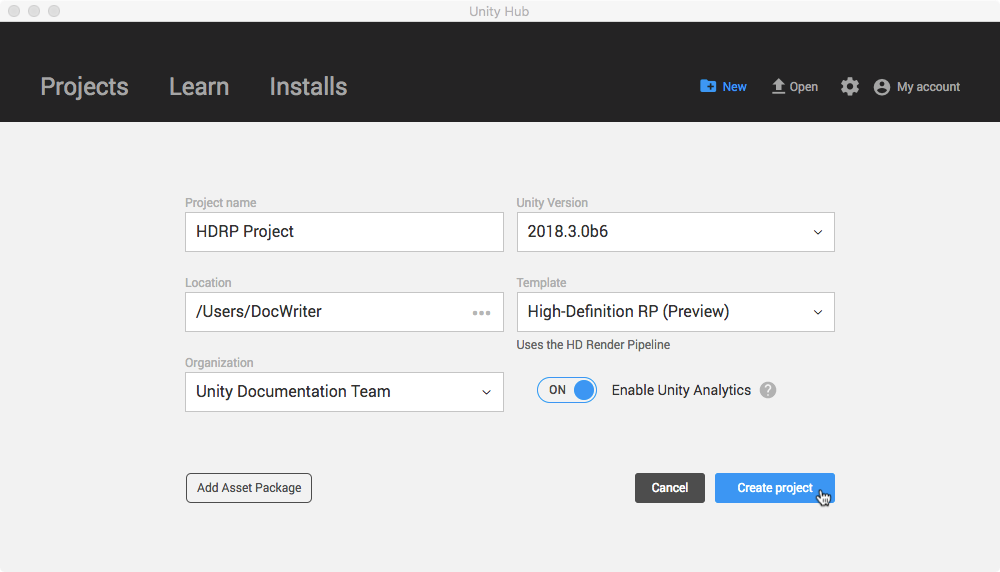
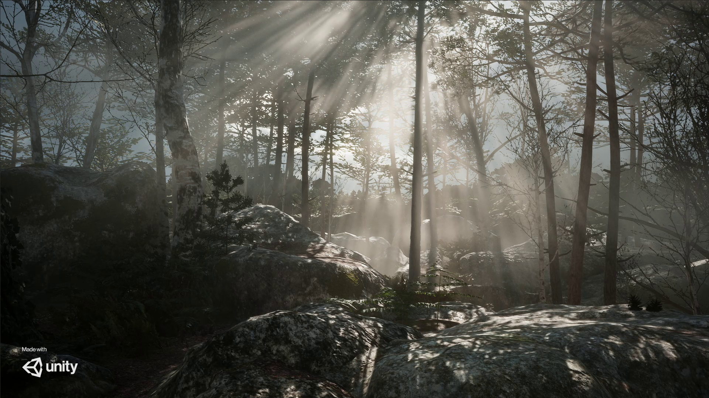

# Getting started with High Definition Render Pipeline

[High Definition Render Pipeline (HDRP)](index.html) uses [Shaders](https://docs.unity3d.com/Manual/class-Shader.html) and lighting units that are different with the built-in Unity rendering pipeline. As such, it’s best to create a new Project for HDRP rendering. This page shows you how to create a Scene that uses HDRP, and introduces you to key features to help you produce high fidelity visuals.

To upgrade a Project that doesn’t use HDRP, you need to convert the Materials to make them compatible with HDRP. For more information, see [Upgrading to HDRP](Upgrading-To-HDRP.html). 

## Creating an HDRP Project

To set up and manage your Unity Projects, install the [Unity Hub](https://docs.unity3d.com/Manual/GettingStartedInstallingHub.html)

To create an HDRP Project:

1. Open the Unity Hub and click the __New__ button in the top-right corner.
2. Enter a __Project Name__ and, in the __Template__ drop-down list, select __High Definition RP (Preview)__.
3. Click __Create Project__.

Unity creates a Project with the HDRP package installed.

## Pipeline setup

Before you can use HDRP, you need an HDRP Asset, which controls the global rendering settings and creates an instance of the pipeline. The __High Definition RP (Preview)__ Template creates an HDRP Asset for you, but you can create different HDRP Assets to suit your rendering needs, such as one HDRP Asset for every target platform. An HDRP Asset allows you to enable features for your entire Project in the Editor. It allocates memory for the different features, so you cannot edit them at run time. For more information, see [HDRP Asset](HDRP-Asset.html).

To find the right balance between rendering quality and run time performance, adjust the HDRP [Frame Settings](Frame-Settings.html). These settings depend on which settings you enable in the HDRP Asset. You can enable or disable Frame Settings at run time.

## Volumes

Volumes enable you to partition your Scene into areas so that you can control lighting and effects at a finer level rather than tuning an entire Scene. Add as many volumes to your Scene as you want, to create different spaces, and then light them all individually for realistic effect. Each volume has an environment, so you can adjust its sky and shadow settings. You can also create custom volume profiles and switch between them.

To add a Volume to your Scene:

1. Create a GameObject, such as a cube (menu: __GameObject__ > __3D Object__ > __Cube__).
2. In the Inspector, click __Add Component__, enter ‘vol’ and click __Volume__.
3. In the __Volume__ section of the Inspector, open the __Profile__ settings by clicking the cog button:

4. Double click the __VolumeSettings__ profile. 

### Visual Environment

The HDRP Visual Environment component enables you to change the type of sky and fog you want in a Scene. For example, use volumetric fog to create atmospheric light rays, like this:

For more information, see [Visual Environment](Override-Visual-Environment.html), [Sky overview](HDRP-Features.html#SkyOverview.html) and [Fog overview](HDRP-Features.html#FogOverview.html).

## Materials and Shaders

HDRP enables you to create materials like glass that refracts light based on definable options. The options for a Material depend on which Shader the Material is using. HDRP shares Material properties across Shaders.

## Lighting

To apply realistic lighting to your Scenes, HDRP uses Physical Light Units (PLU), which are based on real-life measurable values, just like you would see when looking for light bulbs at a store or measuring light with a photographic light meter. For more information, see [Physical Light Units](Physical-Light-Units.html).

For advice on adding lights to your Scene, see [Light](Light-Component.html)

### Light Explorer

HDRP adds settings to the [Light Explorer](https://docs.unity3d.com/Manual/LightingExplorer.html) (menu: __Window > General > Light Explorer__) so that you can adjust the HDRP features and lighting units. 

Use the Light Explorer to change the settings of any type of Light within your Project without having to locate the Lights in the Scene. You can also manage Reflection Probes and Light Probes in this window.

## Shadows

The HD shadow settings allow you to determine the overall quality of the Shadows in a Volume. For example, the __Max Distance__ field calculates the quality of the Shadows based on the distance of the Camera from the Shadow.

For more information, see [HD Shadow Settings](Override-Shadows.html).

## Related information

Explore an HDRP Scene in this [Getting Started Guide for Artists](https://blogs.unity3d.com/2018/09/24/the-high-definition-render-pipeline-getting-started-guide-for-artists/) blog post, but be aware that the blog post uses a pre-release of HDRP, so some properties are different in this release.

