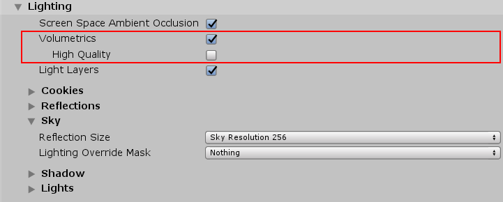
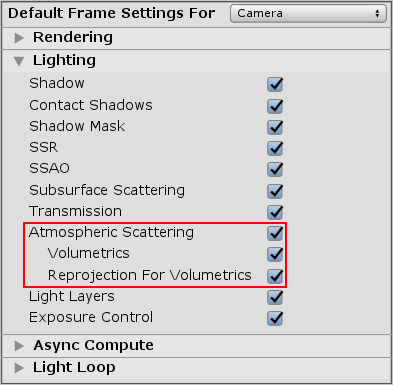

# Volumetric Lighting

The High Definition Render Pipeline (HDRP) includes a volumetric lighting system that renders Volumetric Fog. HDRP also implements a unified lighting system, which means that all Scene components (such as Lights, as well as opaque and transparent GameObjects) interact with the fog in order to make it volumetric.

## Enabling Volumetric Lighting

To toggle and customize Volumetric Lighting in an [HDRP Asset](HDRP-Asset.html):

1. Open an HDRP Asset in your Unity Project and view it in the Inspector. Enable the **Volumetrics** checkbox in the **Lighting** section to enable Volumetric Lighting.
   
2. If you want to increase the resolution of the volumetrics, enable the **Increase resolution of volumetrics** checkbox. Volumetric lighting is an expensive effect, and this option can potentially increase the cost of volumetric lighting by up to eight times.
3. In the **Default Frame Settings** section, under the **Lighting** subsection, make sure you enable **Atmospheric Scattering** and **Volumetric** if they are not already.
   
4. If you want to enable reprojection support, check **Reprojection for Volumetrics** . This option improves the lighting quality in the Scene by taking previous frames into account when calculating the lighting for the current frame. Currently, this option is not compatible with dynamic lights, so you may encounter ghosting artifacts behind moving Lights. Additionally, using high values for **Global Anisotropy** in the [Volumetric Fog](Override-Volumetric-Fog.html) Volume override may cause flickering Shadows.
